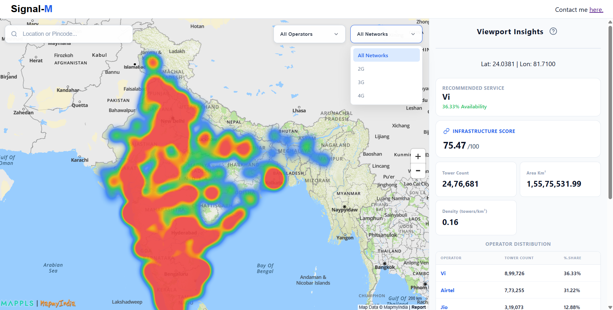
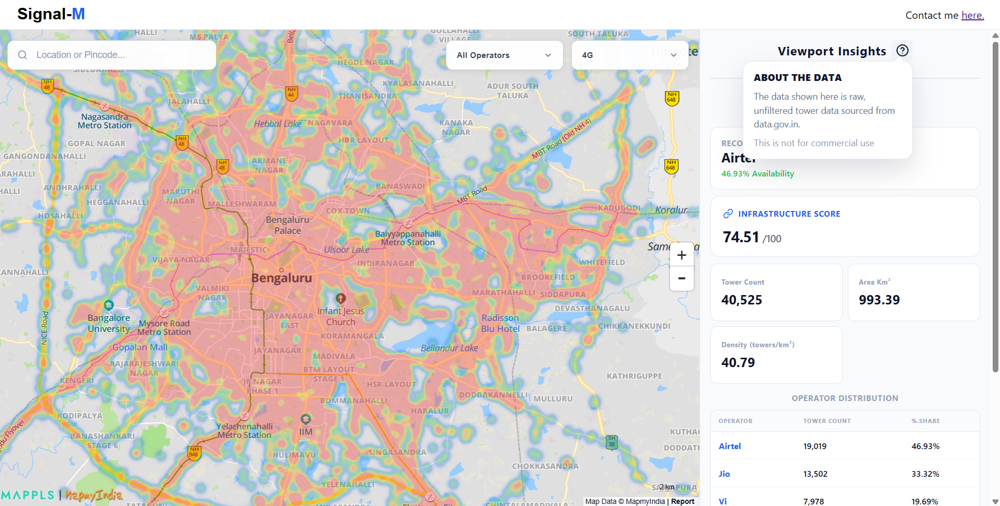
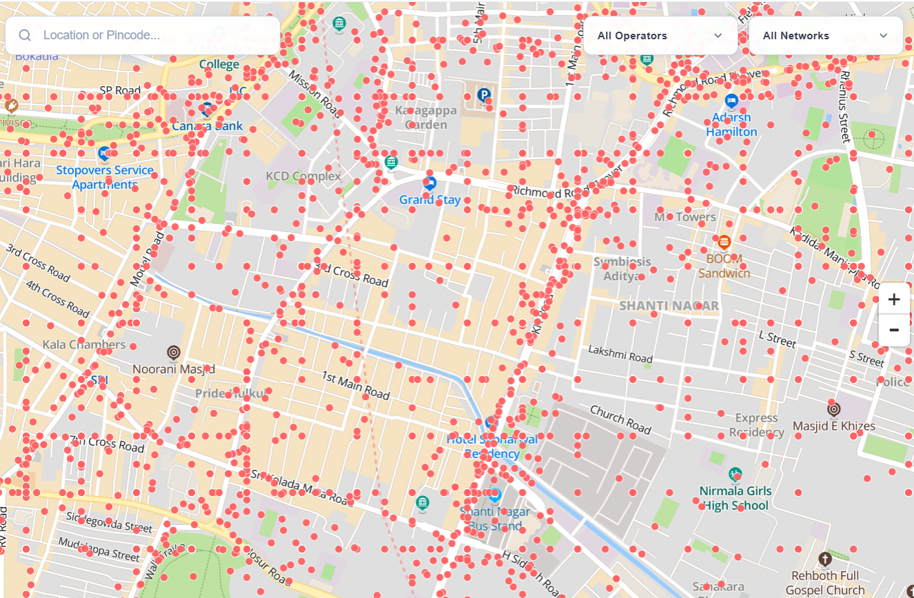
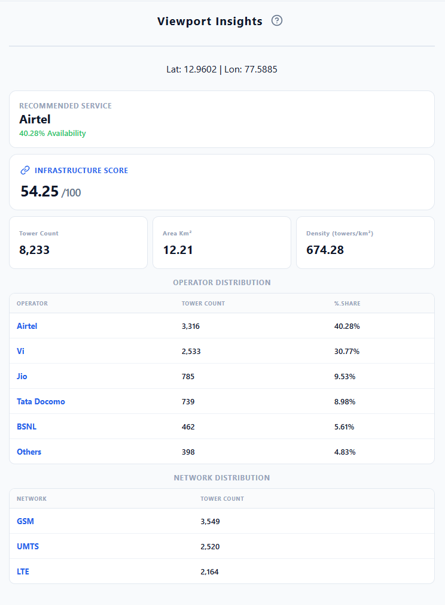
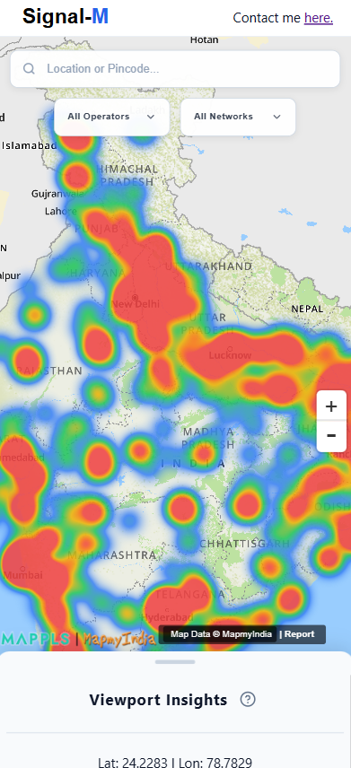

# Signal-M

Going somewhere and have no idea which cell operator will actually work there?
I had the same issue, so I built Signal Map: an interactive map that visualizes cellular tower data across India and gives you useful insights to make the right decision.

Check it out: [signal-map-beryl.vercel.app](https://signal-map-beryl.vercel.app/)

## Screenshots

<table>
  <tr>
    <td align="center"><strong>Dashboard Overview</strong></td>
    <td align="center"><strong>Heatmap Overview</strong></td>
  </tr>
  <tr>
    <td></td>
    <td></td>
  </tr>
  <tr>
    <td align="center"><strong>Tower Overview</strong></td>
    <td align="center"><strong>Insights</strong></td>
  </tr>
  <tr>
    <td></td>
    <td></td>
  </tr>
</table>

<p align="center">
  <strong>Dashboard Overview (Mobile)</strong><br/>
  
</p>

## Stack

- **Backend** Python + FastAPI. Serves tower and heatmap data via a REST API with viewport-aware quantized fetching to reduce load.
- **Frontend** React + Vite. Renders map layers using MapLibre/Mapbox, consumes backend APIs via `frontend/src/api/towers.api.js`.

## Database

PostgreSQL + PostGIS with SQLAlchemy (raw spatial queries use `text()` where needed).

The dataset contains ~2.5 million tower records in under 400MB. Key techniques that keep queries fast at scale:

- PostGIS spatial indexing on tower coordinates for efficient bounding-box queries.
- Viewport-quantized backend queries: snapping bounds to a grid improves cache hit rates and reduces redundant DB calls.
- Serverless Postgres (Neon) in production to simplify pooling and cold-start handling.

These optimizations keep latency low even for large viewports.

## Features

- Heatmap layer - signal density and strength across regions.
- Raw tower layer - per-tower inspection and filtering by operator.
- Best-network recommendation for the current viewport.
- Viewport stats - tower count, per-operator coverage percentages, area (km^2), and tower density (towers/km^2) for the current viewport.
- Viewport-optimized fetching - limits API calls during map interaction.
- Infrastructure scoring - a client-side viewport-level score (0-100) computed from radio tech mix, operator diversity, and coverage.
- Search - backend geocode proxy and frontend search UI for location and tower lookup.

## API (selected endpoints)

- `GET /towers` - fetch towers in bounds (params: `min_lat`, `max_lat`, `min_lon`, `max_lon`, `limit`, `offset`, `network`, `operator`).
- `GET /towers/count` - tower count in bounds.
- `GET /towers/heatmap` - heatmap points (includes `zoom`).
- `GET /towers/operator` - per-operator distribution in bounds.
- `GET /towers/network` - per-network (radio) distribution in bounds.
- `GET /search/fgeocode?q=<query>` - backend geocode proxy (requires `GEOCODE_API_KEY`).

## Implementation Notes

- Scoring: `frontend/src/utils/getInfrastructureScore.js` (tech, operator diversity, coverage).
- Towers API: `backend/src/routes/towers_routes.py` and `backend/src/controllers/towers_controller.py`.
- Search geocode proxy: `backend/src/routes/search_routes.py` (requires `GEOCODE_API_KEY`).
- App entry: `backend/src/main.py` (routes prefixed at `/towers` and `/search`).

## Running Locally

```bash
# Backend
cd backend
pip install -r requirements.txt
uvicorn main:app --reload

# Frontend
cd frontend
npm install
npm run dev
```

## Contributing

PRs welcome. Open an issue first for larger changes.
